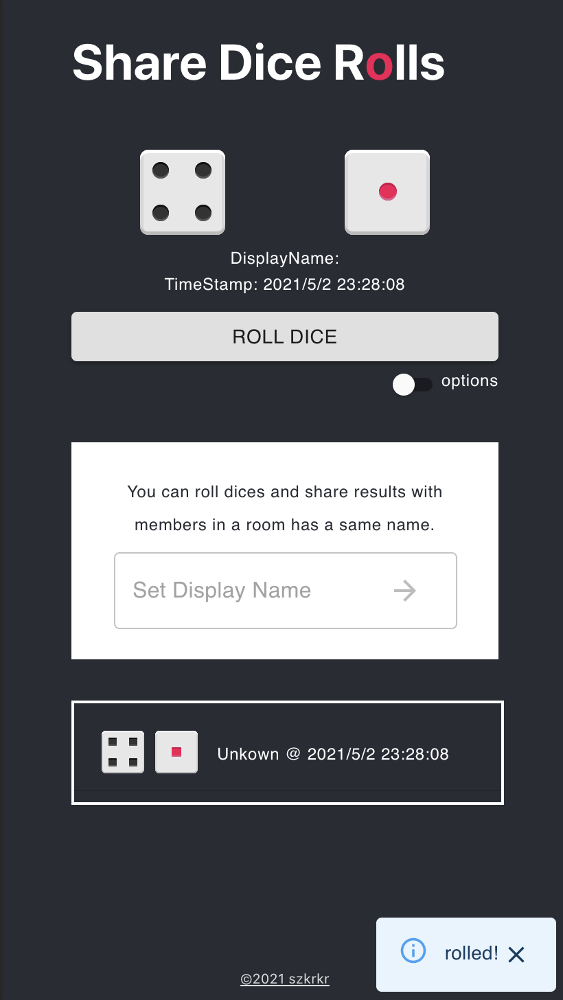
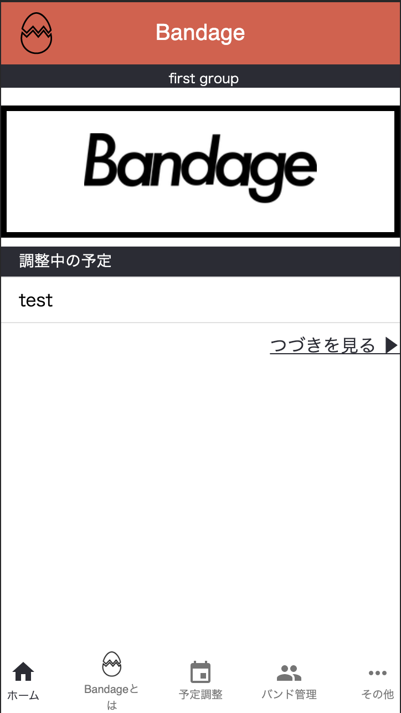
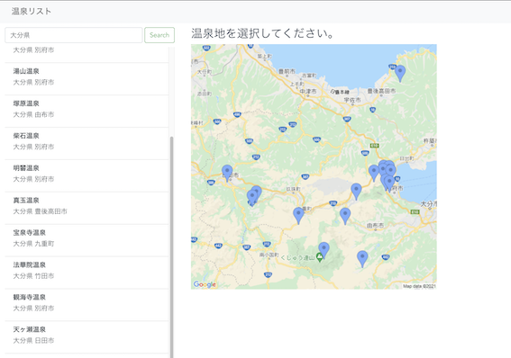

## NPM Pacakges

* <a href="https://www.npmjs.com/package/plain-object-serializer-ts" target="_blank">plain-object-serializer-ts</a> 
It helps to make class instance to plain object.

* <a href="https://www.npmjs.com/package/achex-interfaces" target="_blank">achex-interfaces
</a>  
Interfaces for ACHEX (https://achex.ca/)

## Sites

### 👉 <a href="https://share-dice-rolls.com/" target="_blank">Share Dice Rolls</a> 

#### Overview
You can roll dices and share results with members in a room has a same name.

#### Technology
* Platform: Firebase (hosting)
* Front: JavaScript / TypeScript / React / Redux
* Library: [rpg-dice-roller package](https://www.npmjs.com/package/rpg-dice-roller)

### 👉 <a href="https://npoyui.com" target="_blank">結の会</a> 

#### Overview
Renewal for「結の回」 organization.   
I'm in charge of configure Server (さくらインターネット), WordPress, management of progress.

#### Technology
* Server: さくらインターネット
* DB: MySQL
* CMS: WordPress

### 👉 <a href="https://band-age.net" target="_blank">Bandage</a> 

#### Overview
It's a site for bandsman (JP).    
First, you can adjust your schedule with your group's members.

#### Technology
* Platform: Firebase (authetication, firesotre, storage, hosting)
* Front: JavaScript / TypeScript / React / Redux

### 👉 <a href="https://onsens-dev.web.app/" target="_blank">温泉リスト</a> 

#### Overview
It's practice site for Vue with Algolia, Google Map.
Onsen Data is from 国土地理院。

#### Technology
* Server: Firebase
* Front: JavaScript / TypeScript / Vue / Vuex
* Lib: Aglolia, Google Map API
